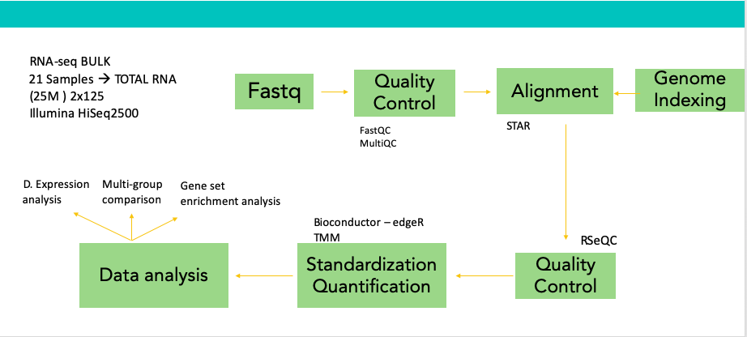

# Analysis of pediatric astrocytoma transcriptome 

In this repository, you will find the basic workflow of a RNA-seq analysis of tumor samples from pediatric astrocytomas. The project aims to cover a differential expression analysis and a Gene set enrichment analysis. 

The libraries were made from Total RNA, (rRNA-depleted) from tumors and contiguous tissue. 

## Objective

Find expression hallmarks that characterized each astrocytoma grade according to the histopathological and molecular classification.

## General workflow

